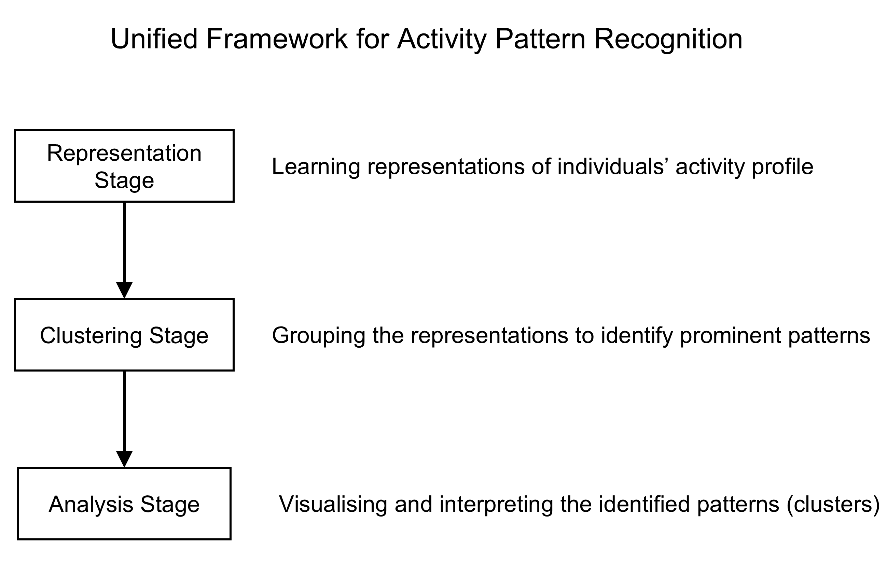
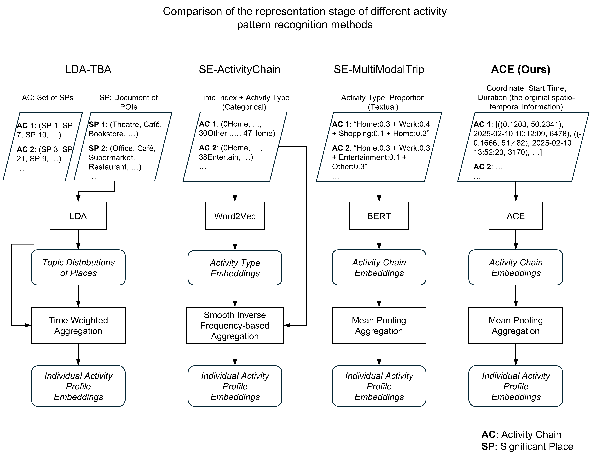

# ACE: Activity Chain Encoder

ACE learns dense representations of human activity chains from mobile-phone-derived stay data. It is designed for modelling daily activity patterns by comparing activity-pattern representations, clustering users by mobility behaviour, and inspecting the temporal and semantic structure of the resulting groups.

Activity pattern modelling/mining can be synthesised as a unified framework:



ACE focuses on the representation stage.

The current implementation trains a Transformer encoder over daily stay sequences. Each stay token combines a frozen place/location embedding with temporal features such as start hour, start minute bucket, duration bucket, and day of week. The model is trained with a supervised contrastive objective and masked activity modelling (MAM), then exports user-level overall, weekday, and weekend activity-profile embeddings.

Below we outline the repository structure, where you can see that the filenames reflect the overall framework: 01_ace, 02_clustering, 03_analysis.

## Repository Structure

```text
.
|-- 01_ace.py                    # Train ACE and export user embeddings
|-- 02_clustering.ipynb          # UMAP + HDBSCAN clustering of ACE embeddings
|-- 03_analysis.ipynb            # Cluster interpretation, heatmaps, personas
|-- ace_config.json              # Main training configuration
|-- ace_experiment.py            # Experiment paths, logging, seeds, plots
|-- activity_chain_dataset.py    # Dataset, sampler, collate, user split helpers
|-- data_preparation.py          # Stay loading and activity-chain preparation
|-- models.py                    # Transformer ACE model and loss functions
|-- training.py                  # Train/eval loops and embedding export
|-- baselines/
|   |-- lda_tba/                 # LDA time-budget-allocation
|   |-- se_act_chain/            # Semantic-Embedding for activity chains (Li et al., 2023)
|   |-- se_multimodaltrip/       # Semantic Embedding for Multimodal Trips (Li et al., 2025)
|-- figs/                        # Framework and paper figures
|-- mobility_data/               # Local input data, ignored by git
|-- sigplaces_and_home/          # Local significant-place data, ignored by git
`-- pretrained_ace/              # Local ACE outputs, ignored by git
```

`01_ace.py` is intentionally kept as a thin entry point. Most reusable logic
lives in standalone modules so that notebooks, scripts, and downstream projects can
import the same implementation.

## Code Organization

- `models.py`
  - `ActivityChainEncoder`
  - `PositionalEncoding`
  - `TemporalEmbedding`
  - `SupConLoss`
  - `ContrastiveMAMLoss`
- `activity_chain_dataset.py`
  - `ActivityChainDataset`
  - `HybridPKSampler`
  - `ace_collate_fn`
  - `build_weekpart_identity_map`
  - `build_split_from_users`
- `data_preparation.py`
  - `load_and_prepare_stays`
  - `prepare_activity_chain_index`
  - `load_location_encoder`
- `training.py`
  - `train_one_epoch`
  - `eval_one_epoch`
  - `run_training_with_early_stopping`
  - `generate_user_embeddings`
- `ace_experiment.py`
  - `load_json`
  - `make_experiment_name`
  - `make_ace_experiment_paths`
  - `configure_experiment_logging`
  - `set_seed`
  - `resolve_device`
  - `plot_training_history`

## Method Overview

ACE represents each user-day as an ordered activity chain.

An activity, or stay event, usually includes coordinates, start time, and duration. We represent these aspects comprehensively using:

- a frozen spatial embedding, currently [AETHER](https://github.com/inwind0212/AETHER), but also compatible with [CaLLiPer](https://github.com/xlwang233/CaLLiPer) or other spatial embedding models that capture rich urban features;
- a temporal embedding module that accounts for `start minute bucket` (15-min interval), `duration bucket` (5-min interval), and `day of week`; and
- a duration embedding layer.

The encoder projects stay-level features to a shared hidden dimension, adds sinusoidal positional encodings, and passes the sequence through a Transformer encoder. A weekday/weekend prompt token can be prepended to the chain, and the prompt output is used as the default daily chain embedding.

Training combines two losses:

- **Supervised contrastive loss:** pulls together chains from the same individual and day type, and separates chains from different identities.
- **Masked activity modelling (MAM) loss:** masks stay tokens and reconstructs the original frozen spatial embedding at masked positions.

The ACE model is designed with flexibility in mind. It allows users to choose the mask type (`location_only` or `all`), choose between using the prompt token, mean pooling of the last hidden states, or a concatenation of both, and customise the weights of the two training objectives.

After training, daily chain embeddings are averaged at the individual level, and we deliberately distinguish between weekday and weekend embeddings:

- `weekday_embedding`
- `weekend_embedding`
- `overall_embedding` -- fuses weekday and weekend activity chains together

These embeddings can then be clustered with HDBSCAN after UMAP-based dimensionality reduction.

## Data Requirements

Raw mobility data is not included in this repository. To run the pipeline, provide a stay-level CSV or CSV.GZ file with at least:

```text
user_id,start_time,end_time,longitude,latitude
```

To use AETHER for spatial embeddings, coordinates must be mapped to their corresponding raster indices:

```text
row,col
```

For analyses and baselines that use significant places, the expected columns include:

```text
user_id,significant_place
```

and, for home/significant-place metadata:

```text
user_id,significant_place,cluster_x,cluster_y,is_home
```

The default configuration expects London data for `2025-02-10` to `2025-02-23`, but the code can be adapted to other cities by changing paths, CRS, and embedding resources in `ace_config.json`.

## Installation

Create an environment with Python 3.10+ and install the core dependencies:

```bash
numpy pandas matplotlib tqdm torch scikit-learn umap-learn hdbscan rasterio geopandas joblib
```

Baseline notebooks additionally use packages such as:

```bash
gensim shapely
```

Install a PyTorch build that matches your CUDA setup if you plan to train on GPU.

## Configuration

Edit `ace_config.json` before training. The most important fields are:

- `stay_data_path`: path to the stay-level input file.
- `loc_embedding_type`: the spatial embedding model of your choice (ACE uses [AETHER](https://github.com/inwind0212/AETHER) by default).
- `aether_tif_path`: path to the AETHER embedding GeoTIFF when using AETHER.
- (optional) `pretrained_loc_encoder_ckpt_path`: checkpoint path when using [CaLLiPer](https://github.com/xlwang233/CaLLiPer).
- `save_dir`: root directory for experiment outputs.
- `device`: for example `cuda:0` or `cpu`.
- `model`: Transformer and masking settings.

The default model configuration uses a 256-dimensional hidden size, 8 attention heads, 4 Transformer encoder layers, 0.2 masking probability, and prompt-token user embeddings.

## Train ACE

Run:

```bash
python 01_ace.py --config ace_config.json
```

If `experiment_name` is `null`, the script creates a timestamped experiment name from the main modelling settings. Outputs are written under:

```text
{save_dir}/experiments/{experiment_name}/
|-- models/
|   `-- best_ace_model_{city}_{loc_embedding_type}.pt
|-- logs/
|   |-- experiment_config.json
|   |-- run.log
|   |-- training_history.csv
|-- embeddings/
|   |-- user_embeddings_{city}_{loc_embedding_type}.pt
|   |-- chain_embeddings_{city}_{loc_embedding_type}.pt
|   |-- user_embeddings_metadata.pt
|-- clustering/
|-- figures/
`-- user_id_mapping.csv
```

## Cluster User Embeddings

Open `02_clustering.ipynb` after training and set:

- `experiment_name`
- `clustering_embedding_type`, one of `overall`, `weekday`, or `weekend`
- UMAP parameters
- HDBSCAN parameter grid or final selected parameters

The notebook reduces user embeddings with UMAP, evaluates HDBSCAN settings with DBCV and outlier proportion, saves clustering results, and selects representative users by cosine similarity to cluster centroids.

## Interpret Clusters

Use `03_analysis.ipynb` to inspect temporal-semantic profiles and persona evidence. The notebook builds cluster heatmaps by time bucket, compares weekday and weekend patterns, and can enrich clusters with home-location geography and census profiles when the required external data is available.

## Baselines

The `baselines/` directory contains the implementation of three baseline methods. A comparison of the baselines and the ACE model is illustrated below:



- **LDA-TBA:** represents users by time-budget-weighted topic distributions over POI semantics around pre-identified significant places.
- **SE-ActChain:** assigns deterministic semantic activity labels to significant places, constructs 48-slot daily activity chains, learns CBOW Word2Vec activity embeddings, and aggregates them with Smooth Inverse Frequency weighting.
- **SE-MultimodalTrip:** additional semantic-enriched trip representation experiments.

These baselines use their own notebooks and output folders, but follow the same general pipeline: UMAP dimensionality reduction followed by HDBSCAN.

## Reproducibility Notes

- Random seeds are configured in `ace_config.json`.
- Train/validation splitting is user-level to avoid identity leakage.
- Generated outputs, mobility data, and significant-place data are ignored by git.
- Some default paths are local machine paths and should be changed before reuse.
- Mobile-phone-derived mobility data can be highly sensitive. Do not commit raw trajectories, user IDs, home locations, or derived artifacts that could identify individuals.
